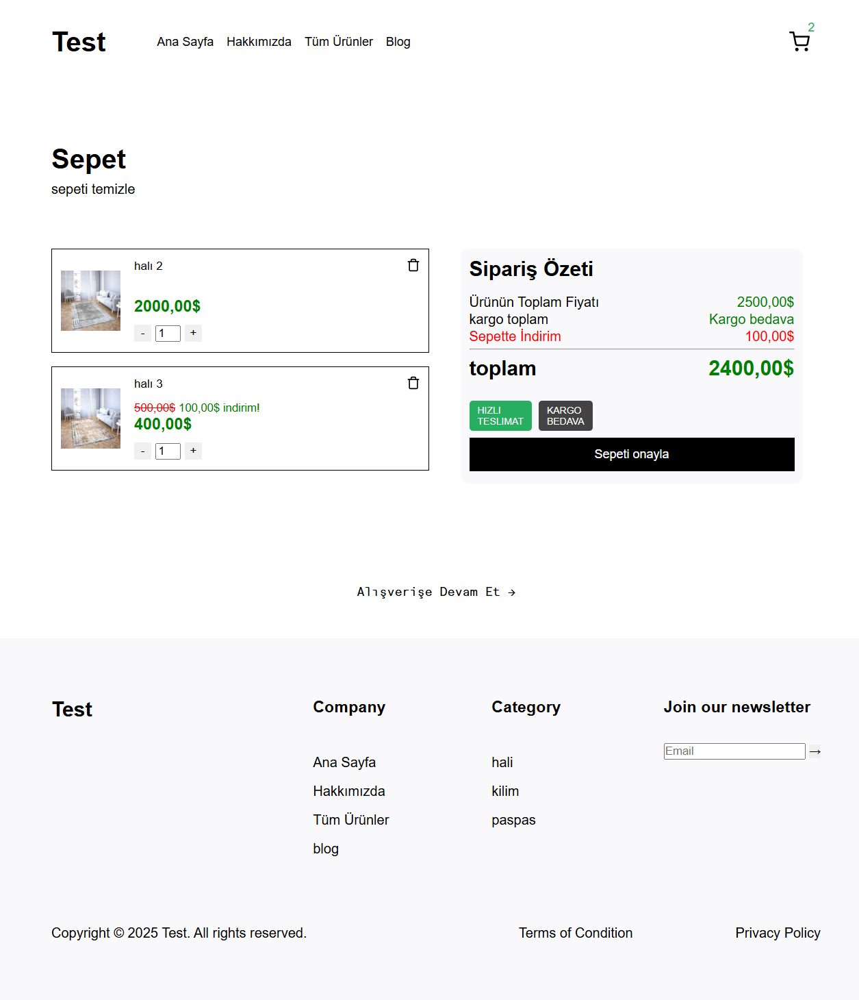
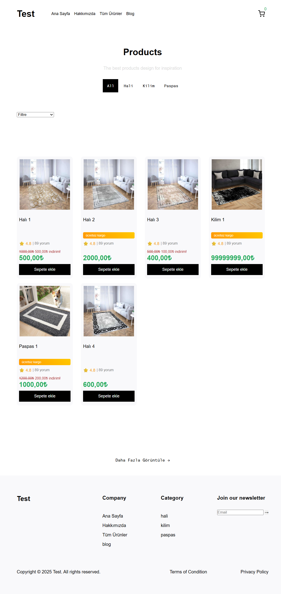
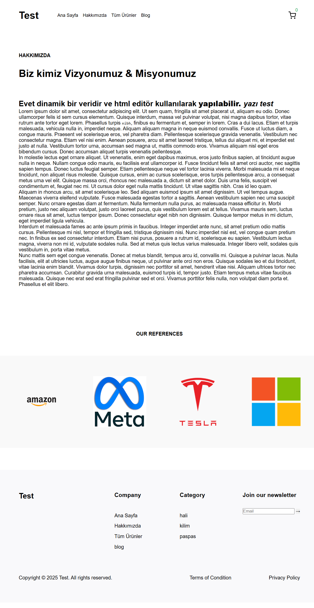
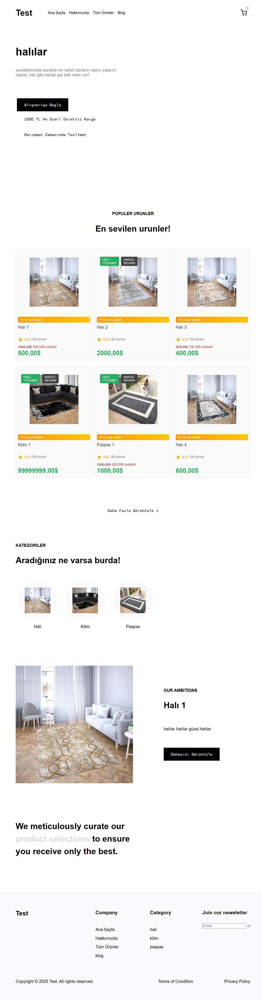
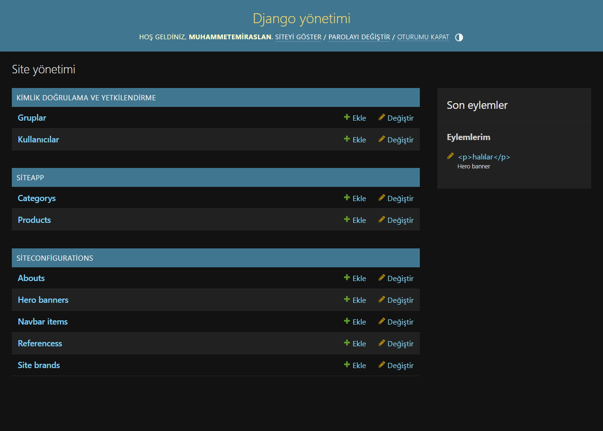

# Proje Başlığı

django ile geliştirilmiş basit e ticaret sitesi

# İçerik

    admin panelinden içerik girişi, navbar tasarımı

    sepet sistemi

    kategorilendirme

    filtreleme

    
## Ekran Görüntüleri










## Bilgisayarınızda Çalıştırın

Projeyi klonlayın

```bash
  git clone https://github.com/muhammetemiraslan/site.git
```

Gerekli paketleri yükleyin

```bash
  pip install -r requirements.txt
```

Sunucuyu çalıştırın

```bash
  python ./manage.py runserver
```

  
